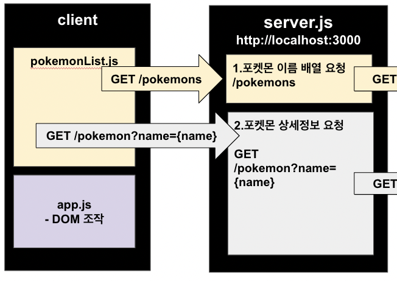
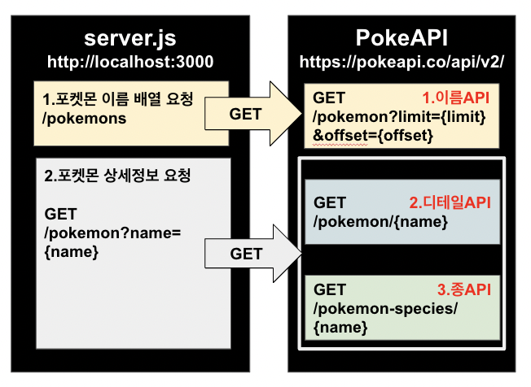

# frontend-2nd-Pokédex

포켓몬 API를 활용해서 포켓몬의 정보를 조회하고 검색할 수 있는 웹사이트

<br/>
<div align="center">
	
</div>
<br/>
<div align="center">
	
</div>

<br/>
<br/>

## **🛠️** 활용 기술

<div style="display:flex; flex-wrap:wrap;" align="center">
  
  
   
  
    
</div>

<br/>
<br/>

## 👨‍👩‍👩‍👩‍주제 및 팀(팀원) 소개

👨‍송원섭

👩‍박은혜

👩‍조명하

👩‍박선주

<br/><br/>

## 🤝협업 방식

소통은 `슬랙`, 문서화는 `노션`, 개발 진행 상황 공유는 `줌 화면 공유`를 활용

<div style="display:flex; flex-wrap:wrap;" align="center">
 
   
<div style="margin: 0 auto; text-align: center;"> </div>
</div>

<br/><br/>

## 🧚‍♀️ESLint 규칙 및 적용 후기

<div align="center">
	
</div>

### ESLint 규칙+prettier 규칙

> -   변수명 CamelCase 사용
> -   선언 후 재할당되지 않는 변수에 대해 const 키워드 사용
> -   세미콜론 항상 사용
> -   따옴표는 backtic(`)만 사용
> -   들여쓰기 4칸
> -   CSS속성이 정렬되도록 설정
> -   여러 줄을 사용할 때 쉼표 붙임

코드의 가독성이 높아져서 다른 사람의 코드를 이해하기가 쉬웠고 자동으로 규칙에 맞게 코드를 바꿔줘서 편리했습니다.

<br/><br/>

## 🤩도메인 용어 정의


#### 사용한 API 정보:

-   `포켓몬 이름 API` : /pokemon?limit={ `limit` }&offset={ `offset` } : 영어 이름들
-   `포켓몬 디테일 API` : /pokemon/{ `name` } : 아이디, 영어 이름, 타입, 키, 몸무게, 이미지
-   `포켓몬 종 API` : /pokemon-species/{ `name` } : 한국어 이름, 습성, 종

#### 용어 정의:

함수의 기능을 최대한 직관적으로 표현할 수 있도록 네이밍

| 메소드              | 기능                                                            |
| ------------------- | --------------------------------------------------------------- |
| getPokemonGroups()  | 전체 포켓몬 리스트 10초마다 부르기 (새로고침 이후 700개 까지)   |
| searchEventAll()    | 포켓몬 검색 이벤트 공통(클릭, 엔터)                             |
| pokemonSearch()     | 검색 입력 정규식 (입력된 문자가 포함된 모든 포켓몬 리스트 리턴) |
| addHtml()           | 검색된 포켓몬 수 만큼 동적으로 HTML태그 추가                    |
| selectTypes()       | 각 포켓몬별 속성값 리턴                                         |
| typeButtonHandler() | 각 속성별 포켓몬 검색 이벤트 핸들러                             |

<br/>
<br/>

# [🎠기능 시연](http://localhost:3000/)

0. 로딩

1. 포켓몬 추가

2. 상세정보 모달

3. 로고 클릭

4. 속성 버튼 클릭

5. 이름 검색

<br/>
<br/>

# 🎆핵심 기능 설명 및 구현 방법<br><br>

## 1. Client 파일 분리<br>

<div align="center">

</div>

#### 1.1 pokemonList.js : server.js에 포켓몬 정보 요청 코드

-   `GET /pokemons`로 포켓몬들 이름을 요청하고, 받아온 이름들을 순회하면서
-   `GET /pokemon?name={name}`으로 상세 정보를 요청합니다.

<br/>

#### 1.2 app.js : DOM 조작 코드 (아래와 같은 형태로 정보 나타내기)

<div align="center"></div>

<br/><br/>

## 2. 서버가 포켓몬 API에 요청

<div align="center">
	
</div>

#### 2.1 포켓몬 이름 API 요청

```javascript
// 요청 결과
 [{'name': 'pikachu', 'url':'https://pokeapi.co/api/v2/pokemon/1'}, ...]
```

<br/>

#### 2.2 포켓몬 디테일 API 요청

처음 요청에서 받아온 배열의 `name: pikachu`값으로 요소마다 각각 `디테일API`로 상세정보 요청

```javascript
// 요청 결과
{
'species':{
	'name':"ditto"
	'url':"https://pokeapi.co/api/v2/pokemon-species/132/"
},
...,
}
```

<br/>

#### 2.3 포켓몬 종 API 요청

2.2에서 받아온 데이터의 species.url로 각 요소마다 `포켓몬 종 API`로 요청을 보냅니다.

그러면 결과적으로 포켓몬의 키, 몸무게, 속성, 습성등이 담겨있는 데이터를 받을 수 있습니다.

<br/><br/>

## 3.검색 기능 (속성, 이름)

#### 속성과 이름을 가지고 포켓몬 찾기

<div align="center">
	
</div>

<br/>

#### 3.1 속성 검색


<br/>

#### 3.2 이름 검색


사실 포켓몬 API 에서 제공하는 것들은 기본적으로 영어 이름와 영어 속성명으로 요청하고 정보를 보여 주게 되어 있음

→ 포켓몬의 한국어 이름을 알려 주는 `종 api` 사용

→ 속성명은 따로 번역해서 사용

<br/>

## 4.디테일 뷰 (포켓몬 카드게임 형식)

실제 포켓몬 카드게임의 카드를 보듯이 앞면, 뒷면을 나누어 보여주며 포켓몬의 습성, 키, 몸무게와 같이 메인 화면에서 볼 수 없던 더 자세한 정보를 보여줌

<div style="display:flex; flex-wrap:wrap;" align="center">
	
	
</div>

<br/>
<br/>

# 😈트러블 슈팅

### 1. PokeAPI 호출 순서 문제

→ 특정 한 마리가 아니라 여러 포켓몬의 정보를 가져오는 API는 `포켓몬 이름 API`밖에 없음

→ `포켓몬 이름 API`를 먼저 호출하고 여기서 주는 영어 이름을 이용해서 상세 정보를 불러와야 함

그렇다면 `포켓몬 디테일 API`과 `포켓몬 종 API` 중에서 어떤 걸 먼저 호출해야 할까? 동시에 호출해도 될까?🤔

→ 정답 : 1) `포켓몬 이름 API` 2) `포켓몬 디테일 API` 3) `포켓몬 종 API`

→ 이유 : 몇몇 포켓몬은 `포켓몬 이름 API`에서 취급하는 이름( ex. deoxys-normal)과 `포켓몬 종 API`에서 취급하는 이름( ex. deoxys)이 달라서 `404 Not Found` 에러가 뜸

→ 해결 방법 : `포켓몬 디테일 API` 에서 주는 species.url을 사용

<br/>

### 2. `server.js` API 설계 문제

→ 클라이언트에서는 포켓몬 정보를 담은 리스트만 있으면 되니까 `GET /pokemons` 하나로 다 처리해볼까?

→ namesRequest로 `포켓몬 이름 API`로 받아온 이름들을 순회하면서 `포켓몬 디테일, 종 API` 호출하는 방식

```jsx
namesRequest(포켓몬이름API, (err, res, body) => {
    const names = JSON.parse(body); // [{"name":"pikachu"}, ...]

    // error: 피카츄 다음 포켓몬 요청은?
    names.map((pokemonName) => {
        const res1 = detailRequest(포켓몬디테일API);
        const res2 = speciesRequest(포켓몬종API);
    });
});
```

→ 문제점 : 맨 처음의 요청은 잘 가는데, 두 번째 이후의 이름을 가지고 deatilRequest와 speciesRequest의 url 값을 업데이트하려 할 때 `[ERR_HTTP_HEADERS_SENT]: Cannot set headers after they are sent to the client`발생

→ 해결 방안 : 이름 리스트를 받아오는 요청(`GET /pokemons`)과 디테일 정보를 받아오는 요청(`GET /pokemon`)을 분리

<br/>

### 3. 요청 처리 속도 문제

PokeAPI에서 정보를 제공하는 포켓몬들의 총 마리수는 **1292!!!**

<div align="center">
</div>

약 500마리의 포켓몬 상세정보 요청 1건의 완료 시간: **52초**

→ 한 번에 요청하는 포켓몬의 개수는 줄이고, 상세정보 요청 수를 늘리자!

→ 해결: **한 번에 10마리씩, 70번 요청**으로 수정 후 약 5초의 **로딩** 시간

<br/>
<br/>

## 🧐회고

> **👨‍송원섭:**
> 파파고 api를 사용해 보면서 이번 프로젝트를 쉽게 따라 할 수 있을 것이라고 생각이 들었지만 막상 진행해보니 환경 세팅부터 기능 구현까지 쉽지 않았습니다. fetch와 async등 사용법에 익숙하지 않아 더욱 어렵게 느껴졌습니다. 저번 프로젝트와 마찬가지로 깃허브 사용에 미숙한 부분이 많아 공부해야겠다는 생각이 들었습니다.

> **👩‍박은혜:**
> API 공식 문서를 읽어보며 자바스립트로 직접 필요한 데이터를 요청해서 처리해보면서 API 통신에 대한 이해도를 얻을 수 있는 프로젝트였습니다. 또한 코드 컨벤션을 정의하고 ESLint, Pritter 와 같은 툴을 사용해보면서 그 중요성을 느꼈습니다. 프로젝트 기획 및 설계 단계에서 꼼꼼할 수록 개발을 혼동없이 진행할 수 있음을 알게됐습니다.

> **👩‍조명하:**
> 언제 fetch()를 사용하고 언제 require()를 사용하는지 이번에 서버 코드를 작성하면서 확실하게 배웠고, 서버 api를 설계할 때 각 요청 간의 의존성을 파악하는 점이 어려웠습니다. 그리고 폴더 구조를 미리 정하지 않고 깃을 사용해서 머지할 때 힘들었습니다. 다음부턴 프로젝트 구조 설계를 먼저 하고 작업을 시작하면 좋을 것 같습니다😊

> **👩‍박선주:**
> Pokemon API는 응답 데이터의 양이 많고 어떤 프로퍼티가 우리가 필요로 하는 데이터인지 JSON 파싱도 어려워 우리가 기존에 사용해본 PAPAGO API보다 훨씬 사용하기 까다로웠습니다. 만약 여러분도 API 배포를 하게 된다면 문서를 친절하게 작성해 주세요.😂 어려운 과제였지만 끝까지 열심히 도와주시고 해내주신 팀원들 너무 감사드립니다!
