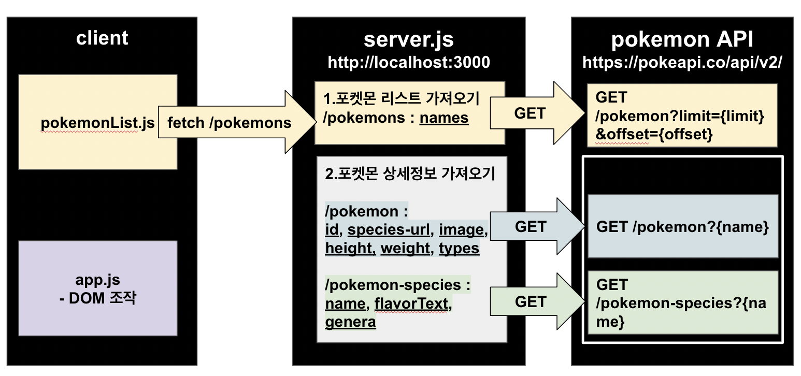
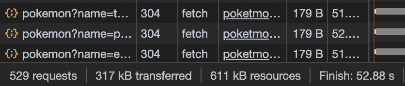

# frontend-2nd-service by Myunagha Cho

## 활용 기술 - HTML, CSS, JS

## 주제 및 팀(팀원) 소개

조명하

## 협업 방식

조명하 : server.js 전반, type으로 포켓몬 검색하기

## 기능 시연(실제로 시연 or gif 이미지 등)

## 핵심 기능 설명 및 구현 방법

- 포켓몬 검색, 포켓몬 속성 검색, 포켓몬 정규식 검색

``` javascript
    // 포켓몬 검색, 리스트 추가
    const searchResult = pokemonSearch(idOrName);
    searchResult.forEach((element) => {
        addHtml(element);
    });
```

``` javascript
    // 정규식 검색, 다중 검색
    const pokemonSearch = (input) => {
        const regex = new RegExp(`${input}`, `g`);
        return pokomonList.filter((pockemon) => pockemon.name.match(regex));
    };
```

``` javascript
    // 속성 타입별 이벤트
    const typeButtons = document.querySelectorAll(`button`);

    const typeButtonHandler = (event) => {
        const pokemonListArea = document.getElementById(`pokemonListArea`);
        pokemonListArea.innerHTML = ``;
        const target = pokomonList.filter((pockemon) =>
        pockemon.types.includes(event.currentTarget.childNodes[3].innerText),
        );
        // pokemonListArea 에 포켓몬 보여주기
        target.forEach((element) => {
            addHtml(element);
        });
    };

    typeButtons.forEach(button => {
        if (button.id !== `searchBtn`) {
            button.addEventListener(`click`, typeButtonHandler);
        }
    });
```


프로젝트 구조


## 트러블 슈팅

- 포켓몬 검색 시 해당 문자가 포함된 모든 포켓몬 출력하기 위해 정규식 사용

``` javascript
    const regex = new RegExp(`${input}`, `g`);
```


1. 포켓몬 디테일 정보 불러오기
   1-1. 특정 포켓몬의 정보를 불러오기 위해서 /pokemon/{name}과 /pokemon-species/{name}을 둘 다 호출해야 함
   -> /pokemon/{name} : id, species-url, image, height, weight, types
   -> /pokemon-species/{name} : name, flavorText, genera

    1-2. species api에 `deoxys-normal` 같은 특정 포켓몬 이름을 넣었을 때 `404 Not Found` 가 뜸
    -> /pokemon/{names} 에서 주는 species url을 사용

```javascript
"species": {
    "name": "deoxys",
    "url": "https://pokeapi.co/api/v2/pokemon-species/386/"
}
```

-> /pokemon/{name} 을 먼저 호출하고, then() 안에서 받아온 species url로 /pokemon-species/{name} 까지 호출하기

1. 포켓몬 리스트 불러오기
   2-1. api 에서 제공하는 포켓몬의 전체 갯수는 1292개, 한 번에 전부 불러오면 PokeAPI에서 차단

2-2. 500개만 불러오는 데에도 52초나 걸림, 너무 긴 로딩


-> 한 번에 조금씩 여러 번 요청하기

## 회고(느낀점) - 팀원 전부 각자 느낀점

- 송원섭 : 파파고 api를 사용해 보면서 이번 프로젝트도 쉽게 따라 할 수 있을 것이라고 생각이 들었지만 막상 진행해보니 환경 세팅부터 기능 구현까지 쉽지 않았다. 저번 프로젝트와 마찬가지로 깃허브 사용에 미숙한 부분이 있어 공부해야겠다.

## 도메인 용어 정의

## ESLint 규칙 및 적용 후기
